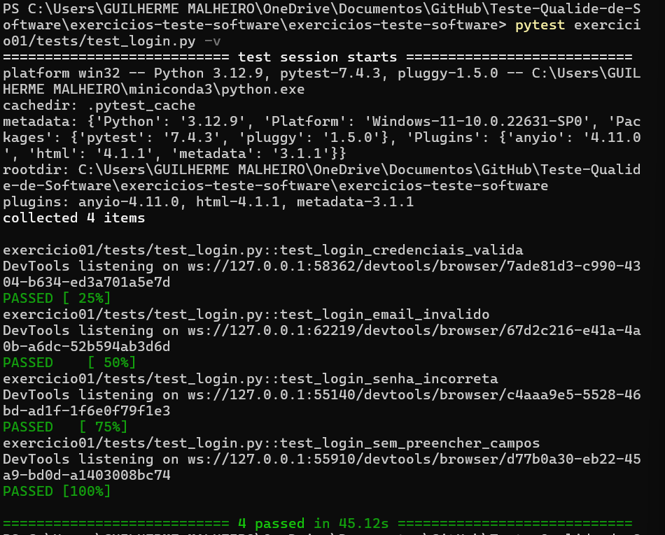
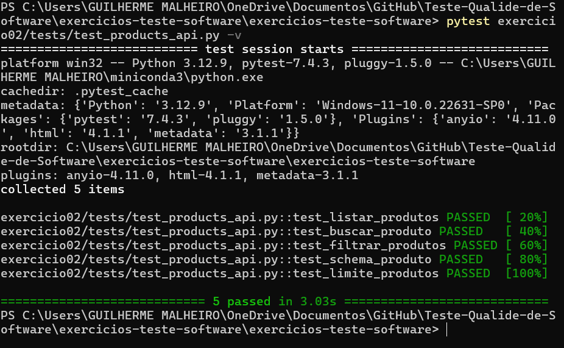
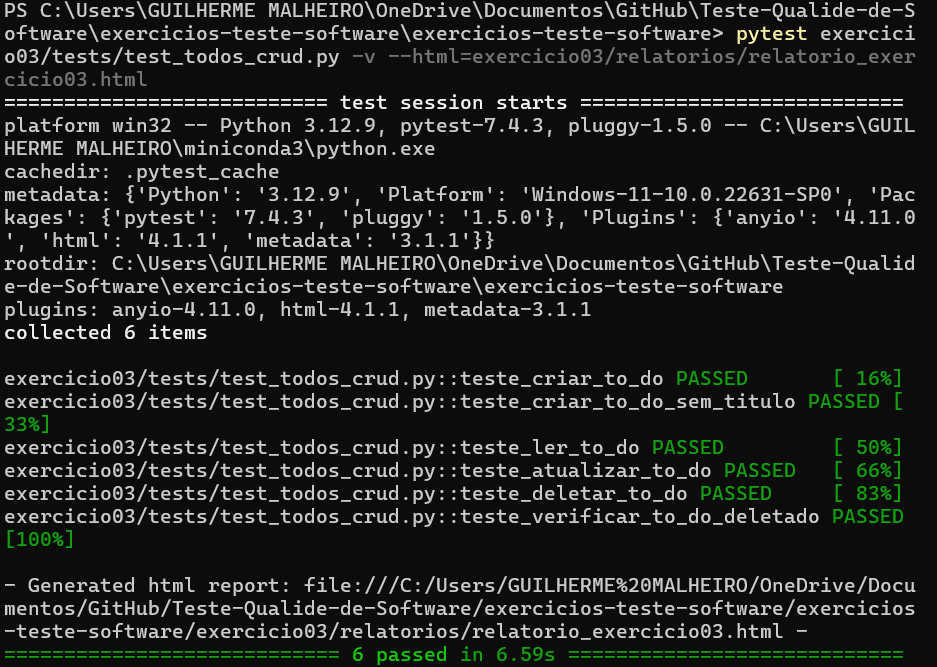

# Exercícios de Teste de Software

Este repositório contém os exercícios de testes automatizados Web e API, desenvolvidos com Python, Selenium, Requests e Pytest.

---


## Pré-requisitos

- Python 3.12+
- Google Chrome instalado
- Instalar dependências:

```bash
pip install -r requirements.txt
```

## Estrutura do Repositório
├── README.md
├── requirements.txt
├── pytest.ini
├── exercicio01/
│ ├── tests/
│ └── relatorio_exercicio01.html
├── exercicio02/
│ ├── tests/
│ └── relatorio_exercicio02.html
├── exercicio03/
│ ├── tests/
│ └── relatorio_exercicio03.html
├── exercicio04/
│ ├── tests/
│ ├── pages/
│ └── relatorio_exercicio04.html
└── exercicio05/
├── tests/
└── relatorio_exercicio05.html


Todos os testes possuem o relatório HTML para visualização, que está presente na pasta de cada exercício, como exemplificado acima.


## Exercício 1
```bash
pytest exercicio01/tests/ -v
```


## Exercício 2
```bash
pytest exercicio02/tests/test_products_api.py -v
```


## Exercício 3
```bash
pytest exercicio03/tests/test_todos_crud.py -v
```


## Exercício 4
```bash
pytest pytest exercicio04/tests/ -v 
```


## Exercício 5
```bash
pytest exercicio05/tests/test_todos_crud.py -v
```
